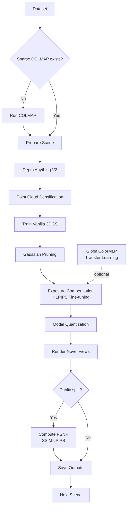
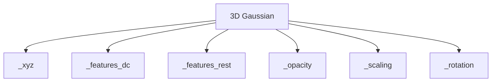
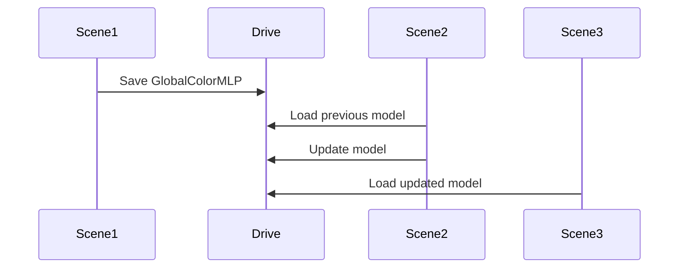

# Novel View Synthesis Pipeline with Vanilla 3D Gaussian Splatting

An automated batch pipeline for Novel View Synthesis (NVS) built on the official **3D Gaussian Splatting** implementation. The pipeline is designed for large-scale multi-scene datasets on **Google Colab**, supports **automatic resume from Google Drive**, and enables lightweight **cross-scene transfer learning** through a shared **GlobalColorMLP**.

---

## Features

- Automatic COLMAP reconstruction (when sparse models are missing)
- Depth densification using **Depth Anything V2**
- Vanilla **3D Gaussian Splatting** training (official Graphdeco implementation)
- Optional Gaussian pruning
- Exposure compensation + LPIPS fine-tuning
- Lightweight cross-scene transfer learning via **GlobalColorMLP**
- Optional model quantization
- Automatic rendering from test poses
- Automatic evaluation (PSNR / SSIM / LPIPS)
- Google Drive resume support for interrupted Colab sessions
- Batch processing for multiple scenes

---

## Pipeline Overview

```
COLMAP
    ↓
Depth Anything V2
    ↓
Point Cloud Densification
    ↓
Vanilla 3D Gaussian Splatting
    ↓
(Optional) Gaussian Pruning
    ↓
Exposure Compensation + LPIPS Fine-tuning
    ↓
(Optional) Model Quantization
    ↓
Rendering
    ↓
PSNR / SSIM / LPIPS Evaluation
```

---

## Complete Pipeline



---

# Why the Official Graphdeco Implementation?

This project uses the official implementation of

> **3D Gaussian Splatting for Real-Time Radiance Field Rendering**
> Kerbl et al., SIGGRAPH 2023

instead of variants such as Scaffold-GS.

The original implementation represents every Gaussian independently:



Compared with Scaffold-GS:

| Vanilla 3DGS | Impact |
|--------------|--------|
| No anchors | Simpler optimization |
| No shared MLP | No shared scene representation |
| Independent Gaussians | Cross-scene Gaussian transfer is not meaningful |
| Lightweight color module | GlobalColorMLP is used instead |

---

# Dataset Structure

```
NVS_data/

├── public_set/
│   ├── Scene0001/
│   │   ├── train/
│   │   │   ├── images/
│   │   │   └── sparse/0/
│   │   └── test/
│   │       ├── test_poses.csv
│   │       └── images/
│   └── ...

└── private_set1/
    ├── Scene0100/
    │   ├── train/
    │   └── test/
    │       └── test_poses.csv
    └── ...
```

The file **test_poses.csv** must contain

```
image_name,
qw,qx,qy,qz,
tx,ty,tz,
fx,fy,cx,cy,
width,height
```

---

# Pipeline Stages

## 0. Environment Setup

The pipeline automatically installs

- COLMAP
- FFmpeg
- PyTorch dependencies
- LPIPS
- Depth Anything V2
- Graphdeco Gaussian Splatting
- diff-gaussian-rasterization
- simple-knn

---

## 1. Data Preparation

Training images are copied from Google Drive.

If

```
train/sparse/0/
```

does not contain a valid sparse model, COLMAP is executed automatically:

```
feature_extractor
→ exhaustive_matcher
→ mapper
```

---

## 2. Depth Estimation & Densification

Depth maps are estimated using **Depth Anything V2**.

The relative depth is aligned to the COLMAP sparse reconstruction using least-squares fitting.

Additional 3D points are then sampled to densify the initial point cloud.

Default settings:

- Maximum new points per image: **500**
- Outlier removal: **95th percentile**

---

## 3. Vanilla 3D Gaussian Splatting

Each scene is trained independently using the official Graphdeco implementation.

Default:

```
iterations = 1440
```

The densification schedule is automatically rescaled from the original 30k-iteration configuration.

---

## 4. Gaussian Pruning (Optional)

Low-opacity Gaussians are removed after training.

Default parameters:

```
opacity threshold = 0.01
minimum keep ratio = 30%
```

---

## 5. Exposure Compensation & LPIPS Fine-tuning

After pruning, the pipeline optimizes

- SH color coefficients
- opacity
- scaling

using

```
Loss =
(1−λ)L1
+ λD-SSIM
+ w(t)LPIPS
```

where the LPIPS weight increases linearly from

```
0.02 → 0.20
```

An independent exposure module is also learned for every training image.

---

## 6. GlobalColorMLP Transfer Learning

Since Vanilla 3DGS contains **no shared scene parameters**, transferring Gaussian attributes between scenes is not meaningful.

Instead, the pipeline introduces a lightweight

```
RGB
 ↓
GlobalColorMLP
 ↓
Corrected RGB
```

The MLP consists of

```
3 → 32 → 32 → 3
```

and learns only a residual color correction.

Within the same dataset split, the model is transferred sequentially:



---

## 7. Model Quantization (Optional)

To reduce storage size,

Geometry tensors are stored as

- FP16

Color tensors are stored as

- INT8

The compressed model is saved, while fake quantization is applied during evaluation so rendered images reflect the compressed representation.

---

## 8. Rendering

Novel views are rendered according to

```
test_poses.csv
```

If transfer learning is enabled, the rendered RGB is corrected by the trained GlobalColorMLP.

---

## 9. Evaluation

For **public_set**, the pipeline computes

- PSNR
- SSIM
- LPIPS

using the provided ground-truth images.

Private scenes are rendered without evaluation.

---

# Automatic Resume

The pipeline automatically scans Google Drive before training.

Completed scenes are skipped.

```
Completed
│
├── finetune/point_cloud_finetuned.ply
└── renders_test/
```

Interrupted Colab sessions can simply rerun the same command.

If transfer learning is enabled, the latest GlobalColorMLP checkpoint is also restored automatically.

---

# Output Structure

```
NVS_output/

public_set/
    Scene0001/
        depth/
        gs_model_backup/
        finetune/
        finetune_quantized/
        renders_test/
        metrics.csv

private_set1/
    Scene0100/
        renders_test/

summary_metrics_public.csv
```

---

# Quick Start

```python
from google.colab import drive

drive.mount('/content/drive')

!python run_pipeline_gpu.py \
    --data_root "/content/drive/MyDrive/data/phase1" \
    --output_root "/content/drive/MyDrive/data/NVS_output"
```

---

# Common Usage

```bash
# Change iterations
python run_pipeline_gpu.py --iterations 1440

# Enable transfer learning
python run_pipeline_gpu.py --transfer_learning

# Disable pruning and quantization
python run_pipeline_gpu.py --no_prune --no_quantize

# Disable AMP
python run_pipeline_gpu.py --no_amp

# Train selected scenes
python run_pipeline_gpu.py --scenes Scene0001,Scene0002

# Retrain everything
python run_pipeline_gpu.py --force_retrain
```

---

# Command-Line Arguments

| Argument | Default | Description |
|-----------|---------|-------------|
| iterations | 1440 | Training iterations |
| sh_degree | 3 | SH degree |
| finetune_iters | 1000 | Fine-tuning iterations |
| transfer_learning | False | Enable GlobalColorMLP |
| prune | True | Gaussian pruning |
| quantize | True | Model quantization |
| amp | True | Mixed precision |
| depth_batch_size | 16 | Depth inference batch size |

---

# Default Configuration

| Component | Value |
|------------|-------|
| Depth Anything V2 | ViT-L |
| New points/image | 500 |
| SH degree | 3 |
| λD-SSIM | 0.2 |
| LPIPS weight | 0.02 → 0.20 |
| GlobalColorMLP | 3→32→32→3 |
| Geometry | FP16 |
| Color | INT8 |

---

# Acknowledgements

- **Graphdeco-INRIA** — Official implementation of 3D Gaussian Splatting (Kerbl et al., SIGGRAPH 2023)
- **Depth Anything V2** — Monocular depth estimation
